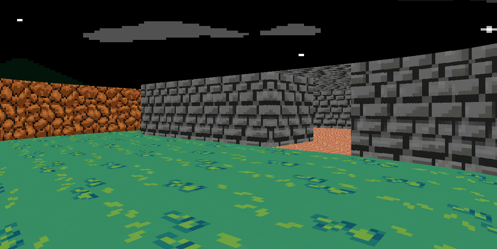
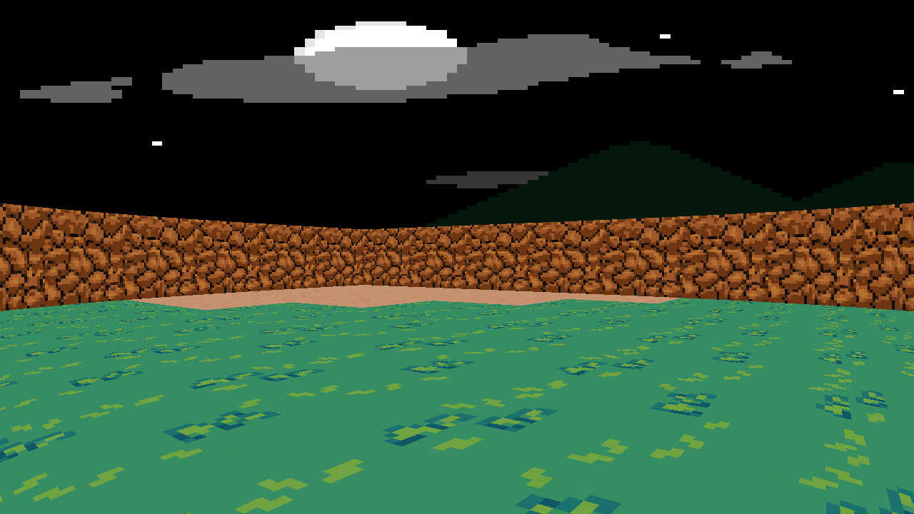

## Screenshots


_Scene_


_Scene_

## Requirements

* OpenGL 4.0 and above
* GLFW
* GLEW 
* GNU Make

## Download and Build

```console
git clone https://github.com/Myth512/raycaster
cd raycaster
make build
```

## Run

```console
make run
```

or

```console
./bin/raycaster 

```

## Improvements

* Add sprite drawing
